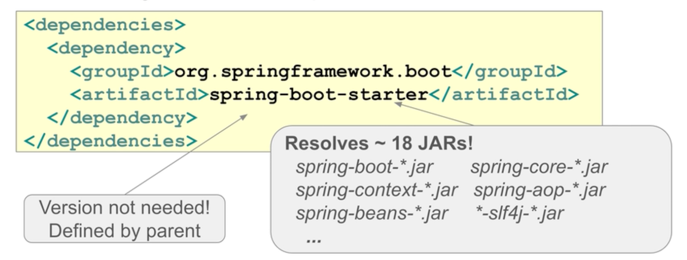
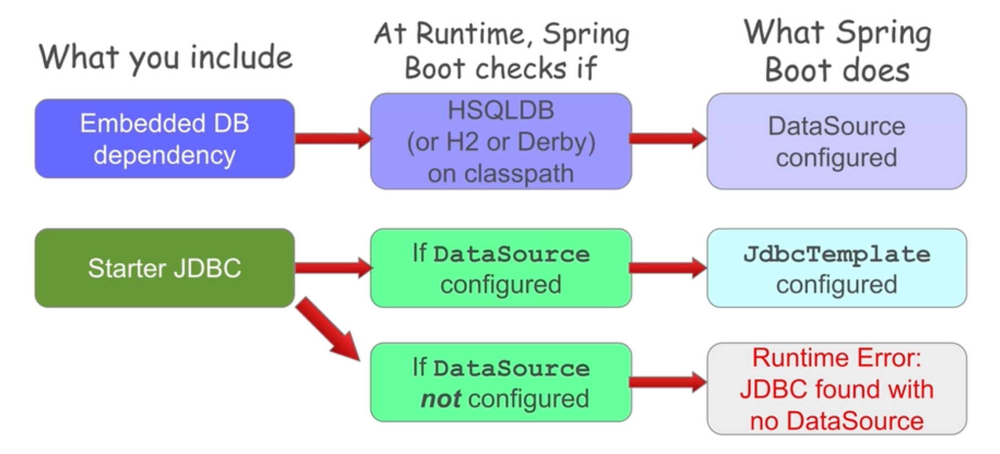
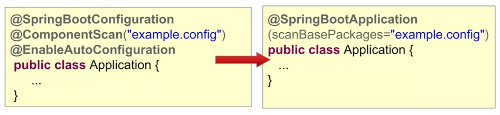
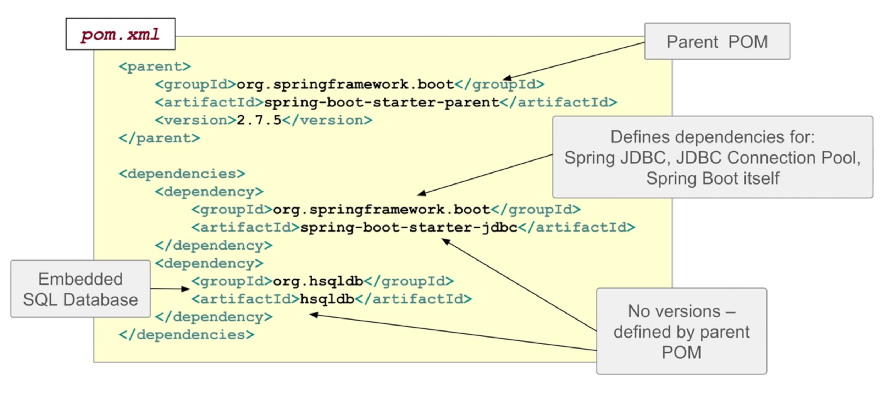
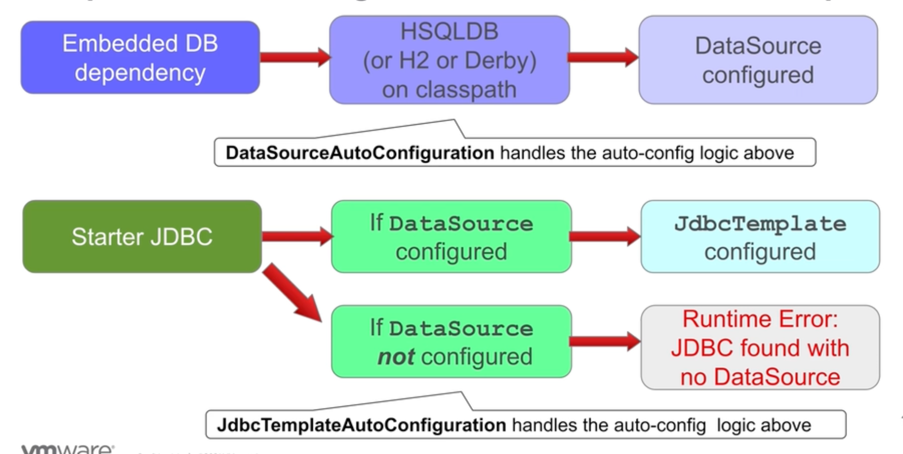
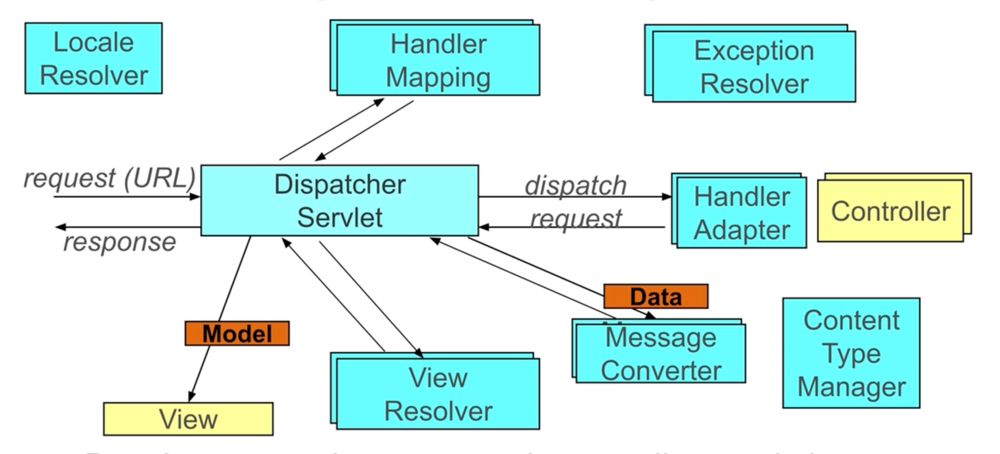
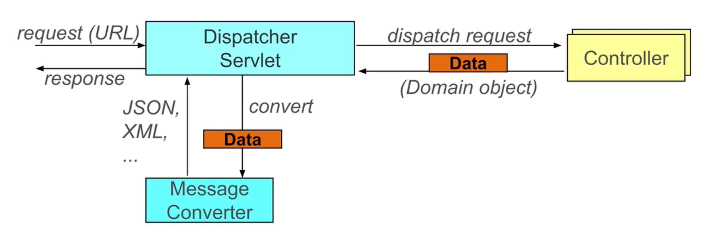
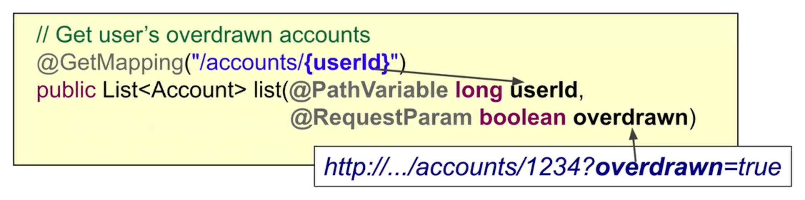

# Spring Boot
## Feature introduction [M1]
- Uses built-in defaults (opinions) to do the obvious setup
- Automatically creates beans that it thinks you need
- Builds "fat" JAR
- Provides a range of non-functional features
  - Embedded servers (App server)
  - metrics (actuator)
  - health check
  - externalized configuration
  - containerization
- Rescue us from dependency hell (compatibility problems)
  - Parent or Starters
  - Fine-grained dependency management is still possible
    - Can exclude dependencies
    - Explicitly define dependencies
- Spring boot parent POM
  - Defines versions of key dependencies
    - Uses a `dependencyManagement` section internally
    - Through `spring-boot-dependencies` as parent
  - Defines maven plugins
  - Sets up Java version
- `spring-boot-starter` pulls ~18 JARs!
  
- Many starters are available
  - spring-boot-starter-jdbc
  - spring-boot-starter-data-jpa
  - spring-boot-starter-web
  - spring-boot-starter-batch
  - [etc...](https://docs.spring.io/spring-boot/reference/using/build-systems.html#using.build-systems.starters)
- Auto-configuration enabled by `@EnableAutoConfiguration` on a config class.
  - Spring Boot automatically creates beans it thinks you need based on some conditions!
  - Examples of it
  
- Very common to use `@SpringBootConfiguration`, `@ComponentScan` & `@EnableAutoConfiguration` together.
  - `@SpringBootConfiguration` simply extends `@Configuration`.
  - `@SpringBootApplication` combines all three.


### Packaging [M1E2]
- We can package our application as a JAR file, WAR file, or in latest versions as an OCI container.
- A "fat" JAR contains all dependencies including a Servlet Container for web applications.
  - Default is Tomcat, but Undertow or Jetty is configurable.
  - Can be run directly using `java -jar`
- Fat JAR is created through the Spring Boot Plugin (for maven or gradle)
  - `mvn package`
  - `gradle assemble`
- Spring boot plugin (maven)
  ```xml
  <build>
    <plugins>
      <plugin>
        <groupId>org.springframework.boot</groupId>
        <artifactId>spring-boot-maven-plugin</artifactId>
      </plugin>
    </plugins>
  </build>
  ```
  - Extends `package` goal to create far JAR.
  - Add `spring-boot:run` goal to run your application.

### Integration testing
- `@SpringBootTest(classes=Application.class)` is alternative to `@SpringJUnitConfig`.
  - even the `classes` parameter is not required!
  - It goes up in hierarchy and tries to find a class annotated with `@SpringBootConfiguration`.
- To run our first Spring application, we only need 3 files.
  - pom.xml
  - application.properties
  - Application class
- Spring initializer [start.spring.io](https://start.spring.io) helps us to start quickly. 

#### Maven pom file


#### application.properties
- Properties can be defined to supplement autoconfiguration or override autoconfiguration.
- Just because we have spring-jdbc and hsqldb in classpath, spring boot will create an in-memory DB, and we'll have DataSource available.

## A Closer Look [M2]
### A Closer Look [M2E1]
#### Location of _application.properties_
- Spring boot looks for it in these locations (**in this order**):
  - `/config` sub-directory of the working directory.
  - The working directory
  - `config` package in the classpath
  - classpath root (like in side `resources` directory)
- Spring boot creates a _PropertySource_ based on these files.
- Spring boot will look for profile-specific properties in files following `applicaiton-{profile}.properties` convention.

#### YAML Support
- Spring boot also supports YAML configs (`application.yml` indented with 2 spaces).
- Requires snakeyaml.jar, provided by spring-boot-starter.
- Spring framework, and @PropertySource do not support YAML config files.
- Multiple profile-specific properties can be placed in a single file.
  - `---` indicates separate logical file.
  ```yaml
  #
  # application.yml
  #
  
  #  Always loaded
  spring.datasource:
    driver: org.postgresql.Driver
    username: transfer-app
  
  ---
  #  Loaded when local profile is active
  spring:
    profiles: local
    datasource:
      url: jdbc:postgresql://localhost/xfer
      password: secret45
  
  ---
  #  Loaded when cloud profile is active
  spring:
    profiles: cloud
    datasource:
      url: jdbc:postgresql://prod/xfer
      password: secret45
  ```
  
#### Property precedence (simplified)
1. Devtools settings (**overrides all**)
2. `@TestPropertySource` and `@SpringBootTest` properties
3. Command line arguments
4. _SPRING_APPLICATION_JSON_ (inline JSON properties).
5. _ServletConfig_ / _ServletContext_ parameters.
6. JNDI attributes from _java:comp/env_
7. Java System properties
8. OS environment variables
9. **Profile-specific application properties**
10. **Application properties / YAML**
11. @PropertySource files
12. SpringApplication.setDefaultProperties. (**gets overridden by all**)

#### @ConfigurationProperties
- Spring boot can map config properties to class properties.
```java
@ConfigurationProperties(prefix="rewards.client")
public class ConnectionSettings {
    private String host;
    private int port;
    private String logdir;
    private int timeout;
    // ...
}

/**
 * application.properties file:
 * 
 * rewards.client.host=192.168.1.42
 * rewards.client.port=8080
 * rewards.client.logdir=/logs
 * rewards.client.timeout=2000
 **/
```
- To enable `@ConfigurationProperties` functionality, we have 3 options:
  - `@EnableConfigurationProperties` on the application class.
  - `@ConfigurationPropertiesScan` on the application class (Spring boot 2.2.0+).
  - `@Component` on the properties class itself.
- Utilization of relaxed binding
  ```java
  @ConfigurationProperties("rewards.client-connection")
  public class ConnectionSettings {
      private String hostUrl;
      // ...
  }
  ```
  - Will match the following _application.properties_ entries:
    - `rewards.clientConnection.hostUrl`
    - `rewards.client-connection.host-url`
    - `rewards.client_connection.host_url`
    - `REWARDS_CLIENTCONNECTION_HOSTURL`

### Auto-Configuration [M2E2]
- `@SpringBootApllication` or `@EnableAutoConfiguration`
- How Does Auto-Configuration Work?
  - Extensive use of Spring-provided auto-configuration classes
    - They are `@Configuration` classes with **conditions**
    - You can create your own custom auto-configuration classes
  - Conditions include
    - Do classpath contents include specific classes?
    - Are some properties set?
    - Are some beans already configured (or not configured)?
  
  

#### @Conditional annotations
```java
// Create JdbcTemplate bean only when DataSource bean already exists
@Bean
@ConditionalOnBean(DataSource.class)
public JdbcTemplate jdbcTemplate(DataSource dataSource) {
    return new JdbcTemplate(dataSource);
}
```
- Added in Spring 4.0.
- Allow conditional bean creation
- `@Profile` is an example of conditional configuration.
- Many others:
  - `@ConditionalOnMissingBean`
  - `@ConditionalOnMissingClass`
  - `@ConditionalOnClass`
  - `@ConditionalOnProperty`
  - Are we in a specific platform?
  - etc...

- What are Auto-Configuration classes?
  - Pre-written Spring configurations
  - `org.springframework.boot.autoconfigure` package
  - See `spring-boot-autoconfigure` JAR file
- Auto-configuration beans processed after explicitly created beans are added.
- `@AutoConfiguration` annotates a class explicitly for autoconfiguration.
- `spring-boot-autoconfigure/META-INF/spring/org.springframework.boot.autoconfigure.AutoConfiguration.imports`

### Override default configuration [M2E3]
- Spring boot is designed to make overriding easy.

#### 1. Set some of Spring Boot's properties
- [Hundreds of pre-defined properties](https://docs.spring.io/spring-boot/appendix/application-properties/index.html) are available.
- Used by Spring-provided `@ConfigurationProperties` / `@AutoConfiguraiton` classes.
- _Example:_ External Database
  ```properties
  spring.datasource.url=jdbc:mysql://localhost/test
  spring.datasource.username=dbuser
  spring.datasource.password=dbpass
  spring.datasource.driver-class-name=com.mysql.jdbc.Driver
  # ^ Driver class name is not required as it is autoconfigured typically
  
  spring.sql.init.schema-locations=classpath:/testdb/schema.sql
  spring.sql.init.data-locations=classpath:/testdb/data.sql
  
  # Connection pool settings
  spring.datasource.initial-size=
  spring.datasource.max-active=
  spring.datasource.max-idle=
  spring.datasource.min-idle=
  ```
  - Spring boot creates a **pooled DataSource** by default.
    - `spring-boot-starter-jdbc` or `spring-boot-starter-jpa` try to pull in a connection pool by default.
    - _Choices:_ Tomcat, HikariCP, Commons DBCP 1 & 2
      - Set `spring.datasource.type` to pick a pool explicitly.
      - Default pool
        - Spring boot 1.x: Tomcat
        - Spring boot 2.x: Hikari
- _Example:_ Controlling logging level
  ```properties
  logging.level=ERROR
  logging.level.org.springframework=DEBUG
  logging.level.com.acme.your.code=INFO
  ```
  - Spring uses SLF4J and the default implementation it uses is Logback.
    - Log4j, Log4j2, and Java Util Logging are usable also.
  - Some properties (Like logging) **cannot be set** in any property files other than `applicantion.properties/yml` because they are needed early on.

#### 2. Explicitly define beans yourself
- Autoconfiguration is generally based on the bean type, not name.
- _Example:_ defining a `DataSource` bean yourself stops Spring Boot from autoconfiguring a default `DataSource`.

#### 3. Explicitly disable some auto-configuration classes
- Via annotation
  ```java
  @EnableAutoConfiguraion(exclude = DataSourceAutoConfiguration.class)
  // Also exists:
  // @SpringBootApplication(exclude = DataSourceAutoConfiguration.class)
  public class ApplicationConfiguration {
      //...
  }
  ```
- Or use configuration
  ```properties
  # application.properties
  spring.autoconfigure.exclude=\
  org.springframework.boot.autoconfigure.jdbc.DataSourceAutoConfiguration
  # comma separated
  ```

#### 4a. Override dependency versions
- Spring Boot POMs preselect the [versions of dependencies](https://docs.spring.io/spring-boot/appendix/dependency-versions/index.html)
  - Ensures the versions of all dependencies are compatible
  - Simplifies dependency management in most cases
- Set the appropriate [version property](https://docs.spring.io/spring-boot/appendix/dependency-versions/properties.html) and version in your `pom.xml` or `build.gradle`
  ```xml
  <properties>
    <spring-framework.version>5.3.22</spring-framework.version>
  </properties>
  ```
  - This only works if you **inherit** from the parent. You need to redefine the artifact if you directly import the dependency.
#### 4b. Explicitly substitute dependencies
- _Example:_ Excluding tomcat and using jetty.
```xml
<dependency>
  <groupId>org.springframework.boot</groupId>
  <artifactId>spring-boot-starter-web</artifactId>
  <exclusions>
    <exclusion>
      <!-- Exclude Tomcat -->
      <groupId>org.springframework.boot</groupId>
      <artifactId>spring-boot-starter-tomcat</artifactId>
    </exclusion>
  </exclusions>
</dependency>
<dependency>
  <!-- Use Jetty -->
  <groupId>org.springframework.boot</groupId>
  <artifactId>spring-boot-starter-jetty</artifactId>
</dependency>
```

#### CommandLineRunner and ApplicationRunner
- Offer a Spring-style entry point for running applications
  - No need to have business logic in the `main()` method.
- `CommandLineRunner`
  - Offers `run()` method, handling arguments as an array.
- `ApplicationRunner`
  - Offers `run()` method, handling arguments as `ApplicationArguments`
  - A more sophisticated argument handling mechanism
- The `run()` methods are invoked before returning from `SpringApplication.run()` but after all the beans are configured.

## Spring Data JPA [M3]
- Starter for spring data jpa is `spring-boot-starter-data-jpa` package.
- If JPA is on classpath, Spring Boot autoconfigures:
  - A `DataSource`
  - A `EntityManagerFactoryBean`
    - This will create `EntityManager`, our 2nd level cache is here.
  - A `JpaTransactionManager`
- Without Spring Boot we need this much config just for EntityManagerFactoryBean:
```java
@Bean
public LocalContainerEntityManagerFactoryBean entityManagerFactory() {
    
    HibernateJpaVendorAdapter adapter = new HibernateJpaVendorAdapter();
    adapter.setShowSql(true);
    adapter.setGenerateDdl(true);
    adapter.setDatabase(Database.HSQL);

    Properties props = new Properties();
    props.setProperty("hibernate.format_sql", "true");

    LocalContainerEntityManagerFactoryBean emfb =
        new LocalContainerEntityManagerFactoryBean();
    emfb.setDataSource(dataSource);
    emfb.setPackagesToScan("rewards.internal");
    emfb.setJpaProperties(props);
    emfb.setJpaVendorAdapter(adapter);

    return emfb;
}
```
- Spring Boot by default looks in the same package that `@EnableAutoConfigure` annotation is used and all its sub-packages for entities.
- This can be customized using `@EntityScan("rewards.internal")` annotations.
- Vendor-provided properties can be customized in `application.properties`
  - spring.jpa.database
  - spring.jpa.show-sql
  - spring.jpa.hibernate.ddl-auto
  - spring.jpa.properties.hibernate.format_sql
  - Every Hibernate setting can be customized using `spring.jpa.hibernate.xxx`.

### Instant Repositories [M3E2]
- Is a repository that will be **created at runtime**.
- How?
  - Step 1: Annotate domain class, define keys and structure (standard JPA)
    - using `@Entity`, `@Table(...)`, `@Id`, `@GeneratedValue(strategy = GenerationType.AUTO)`
    - Spring Data provides similar annotations for JPA for other Data stores.
      - MongoDB: `@Document`
      - Gemfire: `@Region`
      - Neo4j: `@NodeEntity`, `@GraphId`
  - Step 2: Define your repository as an _interface_.
    - The basic `Repository<T, K>` interface has no methods and just for marking the class for spring.  
    - Using `CrudRepository<T, ID>` provides following methods
      - `count()`
      - `T save()`
      - `Iterable<T> save()`
      - `Optional<T> findById()`
      - `Iterable<T> findAll()`
      - `Iterable<T> findAllById(Iterable<ID> ids)`
      - `void deleteAll(Iterable<? extends T> entities)`
      - `void delete(T entity)`
      - `void deleteById(ID id)`
      - `void deleteAll()`
    - Using `PagingAndSortingRepository<T, K>` will additionally provide:
      - `Iterable<T> findAll(Sort)`
      - `Page<T> findAll(Pageable)`
- Spring Data will implement it at run-time.
  - Scans for interfaces extending Spring Data Common `Repository<T, K>`.
  - CRUD methods auto-generated if using `CrudRepository<T, K>`
  - Paging, custom queries and sorting supported
- Define your own Repository Interface - Option #1
  - Can define finders, must obey naming convention
    - `find(First)By<DataMemberOfClass><Op>`, Where `<Op>` can be:
      - GreaterThan
      - NotEquals
      - Between
      - Like, ...
    - The naming convention also supports logicals like `And`, `Or`.
    ```java
    public interface CustomerRepository extends CrudRepository<Customer, Long> {
        public Customer findFirstByEmail(String someEmail); // No <Op> for Equals
        public List<Customer> findByOrderDateLessThan(Date someDate);
        public List<Customer> findByOrderDateBetween(Date d1, Date d2);

        @Query("SELECT c FROM Customer c WHERE c.email NOT LIKE '%@%'")
        public List<Customer> findInvalidEmails();
        // Custom query uses query-language of underlying product (here JPQL)
    
        @Query("SELECT u from Customer u where u.emailAddress = ?1")
        Customer findByEmail(String email); // ?1 replaced by method param
    }
    ```
- Spring Boot automatically scans for repository interfaces (just like entities).
- Customization is possible using `@EnableJpaRepositories(basePackages="...")`.
  - For MongoDB it's `@EnableMongoRepositories`.
- Spring uses proxies here to implement the interface and bind it as a bean.
- `@AttributeOverride`: Tells JPA to use the ALLOCATION_PERCENTAGE column to populate the `Percentage.value` field.
  ```java
  @AttributeOverride(name="value",column=@Column(name="ALLOCATION_PERCENTAGE"))
  private Percentage allocationPercentage;
  ```
- `@Transient` prevents db mapping of annotated field.

## Spring MVC [M4]
- Types of Spring MVC applications
  - Web Servlet
    - Traditional approach
    - Based on Java EE Servlet Specification
      - Servlets
      - Filters
      - Listeners
      - etc...
  - Web Reactive (WebFlux)
    - Newer, more efficient
    - Non-blocking approach
    - Netty, Undertow, Servlet 3.1+
    - Requires knowledge of reactive programming
- Everything we need to develop a Spring MVC app is in `spring-boot-starter-web`
  - spring-web.jar
  - spring-webmvc.jar
  - spring-boot-starter.jar
  - jackson*.jar
  - tomcat-embed*.jar
  - ...
- At startup time, spring boot creates Spring MVC components.
  
- Developers need to define only the controllers and views. (yellow-colored)
- Message converters translate objects returned by controller to `json` or `xml`. (`@ResponseBody`)
- Message converters also translate request body to java objects. (`@RequestBody`)

### Request processing lifecycle (REST) [M4E2]

- Message converters
  - Jackson for json/xml
  - JAXB for xml
  - Gson for json

### Controller implementation
```java
@Controller
public class AccountController {
    @GetMapping("/accounts")
    public @ResponseBody List<Account> list() {/*...*/}
}
```
- `@ResponeBody` defines a REST response, turning off the view handling subsystem.
- `@RestController` is a composed annotation. Incorporating `@Controller` and `@ResponseBody`.

#### Controller method arguments
- Spring will inject what we need
  - HttpServletRequest
  - HttpSession
  - Principal
  - Locale
  - etc...
- It's better to decouple form Servlet API, using spring annotations.
- `@RequestParam` Extracts request parameters from the **request URL** and does type conversion.
- `@PathVariable` extracts value from URI template defined with `{...}` placeholder.
  ```java
  @GetMapping("/accounts/{accountId}")
  public Account find(@PathVariable("accountId") long id) {/*...*/}
  ```
- Drop annotation value if it matches the parameter name.
  - How Spring does that? [Reflection](https://docs.oracle.com/javase/tutorial/reflect/member/methodparameterreflection.html)
  
- `@RequestHeader("user-agent")` gives us data from header.
- [More...](https://docs.spring.io/spring-framework/reference/web/webmvc/mvc-controller/ann-methods.html)

### Message converters [M4E3]
- Converts HTTP request/response data.
  - XML: JAXP Source, JAXB2 mapped object*, Jackson-Dataformat-XML*
  - GSON*, Jacksong JSON*
  - Feed data* such as Atom/RSS
  - Google protocol buffers*
  - Form-based data
  - Byte[], String, BufferedImage
- (*) Requires 3rd party libs on classpath
- Automatically setup by Spring Boot (except protocol buffers)
- Uses `Accept` header.

#### ResponseEntity
- Subclasses `HttpEntity` with fluent API
- Set headers or control response content.
```java
ResponseEntity<String> response = ResponseEntity.ok()
        .contentType(MediaType.TEXT_PLAIN)
        .body("Hello Spring");
```

### JAR or WAR configuration [M4E3]
- Using `spring-boot-starter-web` ensures Spring Web and Spring MVC are on classpath.
- Spring Boot autoconfiguration for Web application
  - Sets up `DispatcherServlet`
  - Sets up internal configuration to support controllers
  - Sets up default resource locations (images, CSS, JavaScript)
  - Sets up default Message Converters
  - And much, much more.
- By default, Spring Boot starts up an embedded web container (Tomcat by default)
- For cloud deployment having fat JAR is recommended. ([The 12-Factor App](https://en.wikipedia.org/wiki/Twelve-Factor_App_methodology))
- using WAR is the traditional way.

#### Running within a Web Container (traditional)
```java
// Subclasses Spring’s WebApplicationInitializer
// called by the web container (Servlet 3+ required)
@SpringBootApplication
public class Application extends SpringBootServletInitializer {

    // Specify the configuration class(es) to use
    protected SpringApplicationBuilder configure(
        SpringApplicationBuilder application
    ) {
        return application.sources(Application.class);
    }
}

// Don’t forget to change the artifact type to war
```
- The above
  - Uses dynamic registration of servlets (Servlet 3+)
  - Required no web.xml file.

- We can configure a hybrid WAR
  - can both be used in a servlet container and ran from CLI (`jave -jar`).
  ```java
  @SpringBootApplication
  public class Application extends SpringBootServletInitializer {
  
      protected SpringApplicationBuilder configure(
          SpringApplicationBuilder application
      ) {
          // Used by web container
          return application.sources(Application.class);
      }
      
      public static void main(String[] args) {
          // Ran from CLI
          SpringApplication.run(Application.class, args);
      }
  }
  ```
- However, embedded Tomcat JARs can cause conflicts when running WAR inside traditional web container.
  - Example: running within a different version of Tomcat.
- Best Practice: Mark Tomcat dependencies as provided when building WARs for traditional containers.
- When using spring boot plugin we can create fat jar along with normal jar.
  - Fat jar = uber jar
    - Über is the German word for above or over (it's actually cognate with the English over).
- In a hybrid approach: similar concept applies for WAR, but one with embedded container and another without.
  - Both having full dependencies.

#### Spring Boot Developer Tools