# Spring Framework Essentials
- [Docs](https://docs.spring.io/spring-framework/reference/)

## Service locator pattern vs. IoC container
- Service Locator (SL)
  - Central registry of services.
  - Clients pull dependencies by calling the locator (e.g., ServiceLocator.getService("foo")).
  - Dependencies are hidden in code → harder to see and test.
  - Creates coupling to the locator.
  - Considered an anti-pattern in modern design if overused.

- Inversion of Control (IoC) / Dependency Injection (DI)
  - Container holds a registry of services.
  - Dependencies are pushed into classes automatically (via constructor, setter, or field).
  - Dependencies are explicit → easy to read, maintain, and test.
  - Decouples classes from the container.
  - Preferred in modern frameworks (e.g., Spring, Guice).

- Key Difference
  - SL: “Class asks for what it needs.”
  - IoC/DI: “Container provides what the class needs.”

---

- DI is useful when testing (mocking dependencies)
- First release of spring came out at 2003, on 2004 interface 21 company was the developer.
- 2009 it gor aquired by VMware.
- POJO: A simple Java object that is not bound by any special restriction or framework. It typically just contains fields, constructors, and methods.
- **JavaBean:** A special type of POJO that follows specific conventions:
  1. Must have a no-argument constructor
  2. Private fields
  3. Public getters and setters
  4. Should be serializable

## Spring configuration class [M2]
- Configuration classes is annotated with `@Configuration`
- Configuration `@Bean`s would be eagerly loaded in the correct dependency order.
- By default, the name of the method is the name of the bean. (can be overwritten in the @Bean(name=) annotation call)
- Later the Bean is accessible using `ApplicationContext::getBean()` in 3 forms.
  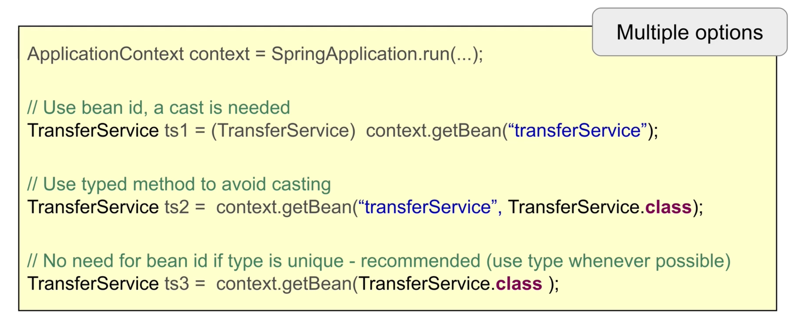
- The Application context is the dependency injection container.
- The application context can be created in any environment. (e.g., Standalone app, web app, JUnit test, etc.)
  - Using `SpringApplication.run(ApplicationConfig.class): ApplicationContext`
- Other configuration classes can be imported to the root config class with `@Import`.
  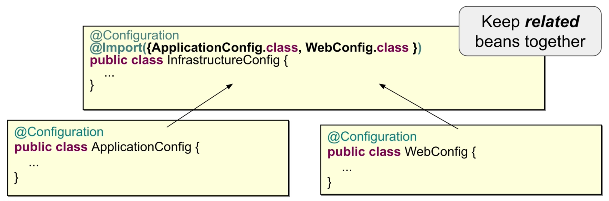
- Dependencies can also be injected in config classes constructors using `@Autowired`.
  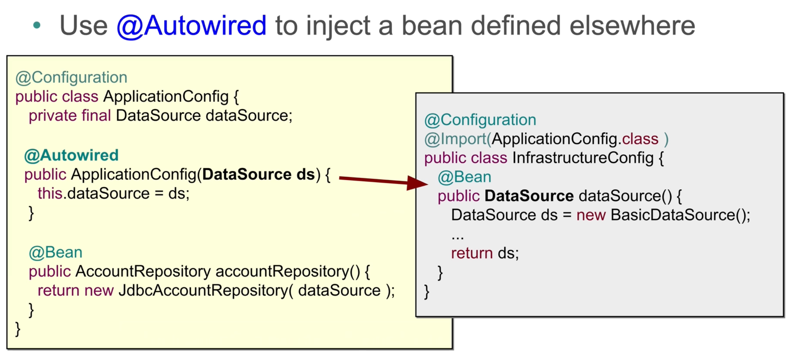
- Avoid tramp data:
  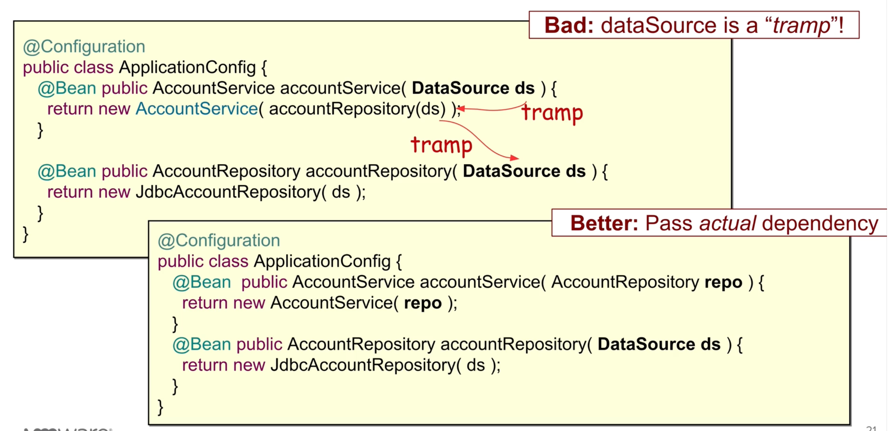

### Common Bean Scopes
  - Singleton (default): so they should be thread safe. either by:
    - Use Stateless or Immutable beans.
    - Use synchronized (harder)
  - Prototype: A new instance is created every time bean is resolved.
  - Session (Web only): A new instance is created once per user session.
  - Request (Web only): A new instance is created once per request.
  ```java
  @Bean
  @Scope("singleton") // Redundant, since it's the default
  // Same as: @Scope(scopeName="singleton")
  public Action deviceAction() {
    //
  }
  ```
  - Web Socket scope (Spring 4)
  - Refresh scope (Spring cloud)
  - Thread scope (Defined but not registered by default)
  - Custom scopes (rarely)
    - You define a factory for creating bean instances
    - Register to define a custom scope name

### DI Summary
- The code is handed with what is needs to work
- Promotes programming to interface
- Improves testability.
- Allows centralized control over object lifecycle.

## More on Configuration [M3]
### Use External Properties to control Configuration [M3E1]
- `Environment` bean represents loaded properties from runtime environment.
- Properties derived from various sources, in this order:
  - JVM System Properties - `System.getProperty()` (Automatically populated)
  - System environment variables - `System.getenv()` (Automatically populated)
  - Java Properties Files (Manually populated)
- `@PropertySource("path_to_tile.properties")` contributes additional properties.
  - Available resource prefixes: `classpath:`, `file:`, `http:`
  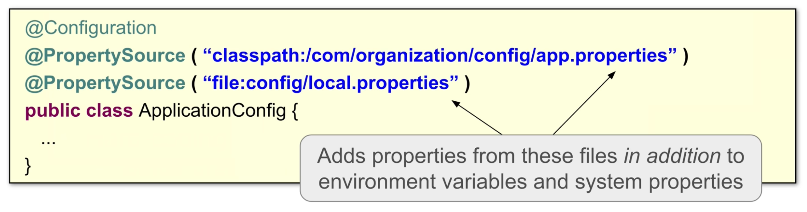
- To retrieve properties either:
  - use `Environment::getProperty(String key)`
  - or use `@Value("${ key }")` as argument annotation.
  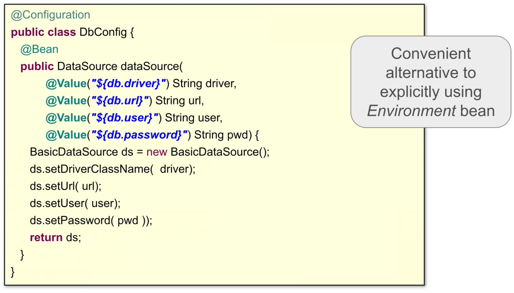

### Profiles [M3E2]

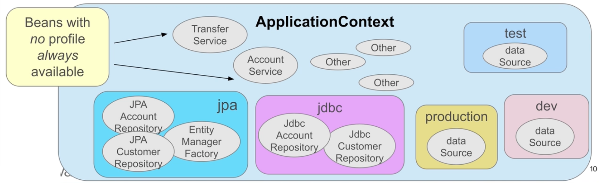

- Beans can be grouped into profiles.
- Profiles can represent:
  - Environments: dev, test, production
  - implementation: jpa, jdbc
  - deployment platform: on-premise, cloud
- Beans included/excluded based on profile membership.
- Defining profiles
  - `@Profile("name")` annotation, at configuration class or method level.
  - `@Profile("!name")` annotation is used to mark all other profiles but `name`.
- Ways to activate profiles (must be activated at run-time)
  - System properties via command-line: `-Dspring.profiles.active=embedded,jpa`
  - System property programmatically:
    ```java
    System.setProperty("spring.profiles.active", "embedded,jpa");
    SpringApplication.run(AppConfig.class); // Before this line!
    ```
  - Integration test only: `@ActiveProfiles` annotation
- `@Profile` annotation can control which `@PropertySource` are included in the environment if mentioned right after.
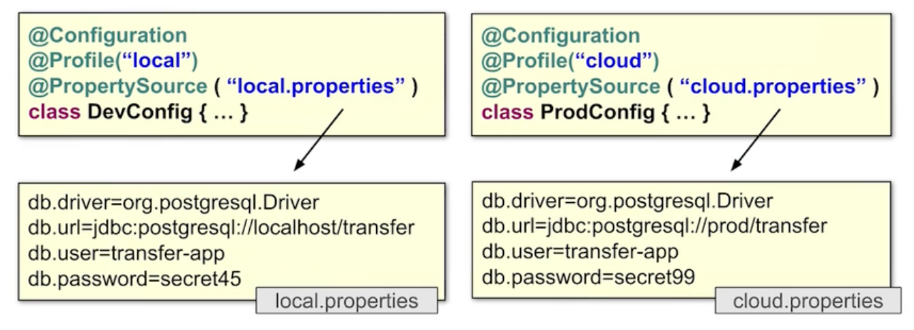

### Spring Expression Language (SpEL) [M3E3]
- Inspired by expression language used in Spring WebFlow
- Based on Unified Expression Language used by JSP and JSF.
- Pluggable/Expandable by other Spring-based frameworks (Spring Security or others).
- `@Value("#{ systemProperties['user.region'] }")`: `#{}` is used instead of `${}`
  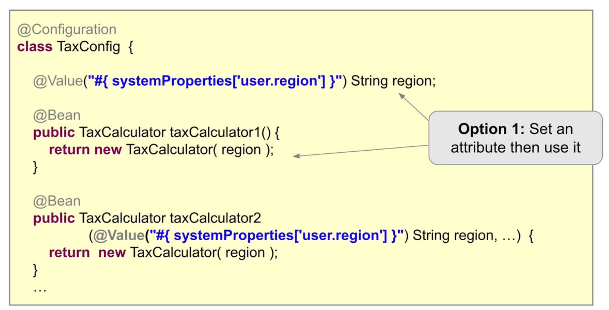
- Can be used to access spring beans
  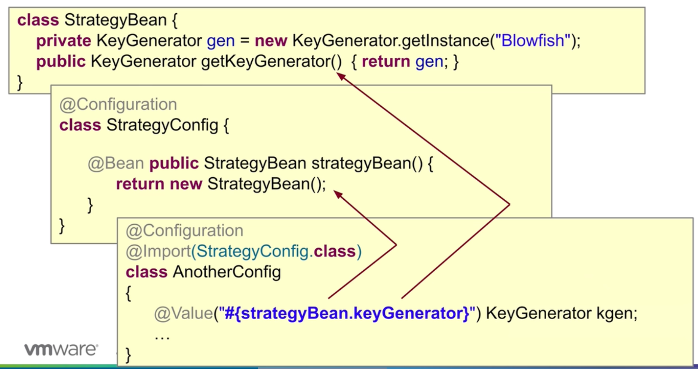
- Can access properties via the environment:
```java
@Value("${daily.limit}")
int maxTransfersPerDay; // Auto conversion, string -> int
// These are equivalent
@Value("#{environment['daily.limit']}")
int maxTransfersPerDay; // Auto conversion, string -> int
```
- But:
```java
@Value("#{new Integer(environment['daily.limit']) * 2}") // OK
@Value("#{new java.net.URL(environment['home.page']).host}") // OK
@Value("${daily.limit * 2}") // NOT OK!
```
- Fallback values
  - `@Value("${daily.limit : 10000})`
  - `@Value("#{environment['daily.limit'] ?: 10000}")` -> `?:` is Elvis operator.

#### SpEL Summary
- EL attributes can be:
  - Spring beans
  - Implicit references
    - Spring's `environment`, `systemProperties`, `systemEnvironment` available by default.
    - Others depending on context. (Spring Security, Spring WebFlow, Spring Batch, Spring Integration)
- SpEL allows to create custom functions and references

## Component Scanning [M4]
### Annotation-based configuration (Implicit Configuration)
- So far we only had explicit configuration (Configuration class and @Bean)
- Annotating a POJO with `@Component` marks it for being bind to the IoC container.
- In this case Bean id/name is derived from the classname (camelCased).
- Then, `@ComponentScan("package.address")` annotation is used in a configuration class to find and bind `@Component`s.
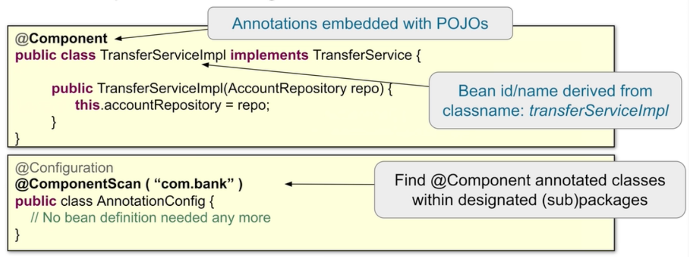

#### Usage of `@Autowired`
- Constructor-injection: (Recommended practice): Optional if only one constructor exists
- Method-injection
- Field-injection: Even when the field is private, it works. But [it's not recommended](https://odrotbohm.de/2013/11/why-field-injection-is-evil/).

⚠️ In all cases: A unique bean of the required type must exist!
- By default if no such bean exists in the container it will result in exception at run-time.
- To prevent such exception we can use `@Autowired(required=false)` to mark it as optional.
- Another way to mark optional dependencies is to use JDK8 `Optional<T>` like so:
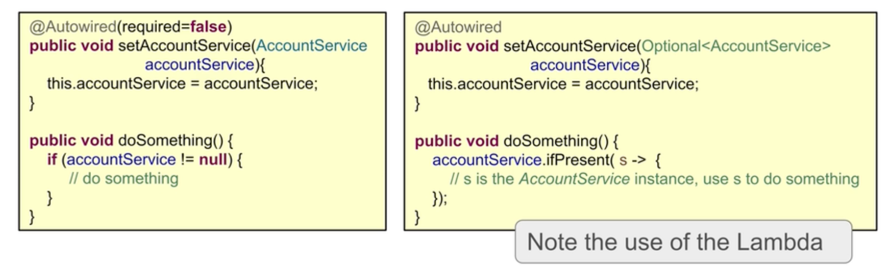

#### Constructor vs. Setter dependency injection
| Constructors                          | Setters                               |
|---------------------------------------|---------------------------------------|
| Mandatory dependencies                | Circular dependencies possible        |
| Dependencies can be immutable         | Dependencies are mutable              |
| Concise (pass several params at once) | Could be verbose for several params   |
|                                       | Inherited automatically               |
- Generally constructor injection is preferred.
- Consistency in the project team is important.

#### Autowiring and Disambiguation
- using `@Qualifier("bean name")`.
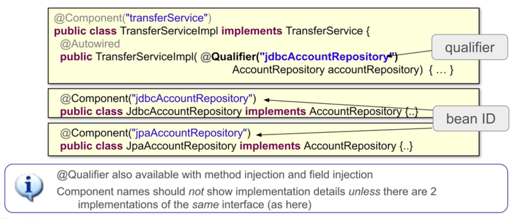
- Variable name can be used to resolve the correct bean!
- Autowired resolution rules
  1. Look for unique bean of required type
  2. (If found multiple) Use @Qualifier if supplied
  3. (If not found) Try to find matching bean by variable name!
- Common strategy: avoid using @Qualifier when possible. Usually rare to have 2 beans of the same type in ApplicationContext.

#### Delayed bean initialization 
- Beans are normally created on startup when the application context is created. (Because we want to fail fast)
- `@Lazy` beans created first time they get used (Careful! often misused)
  - When required for dependency injection
  - By `ApplicaitonContext::getBean()`
- Useful if bean's dependencies not available at startup.

#### Annotations syntax vs. Java Config
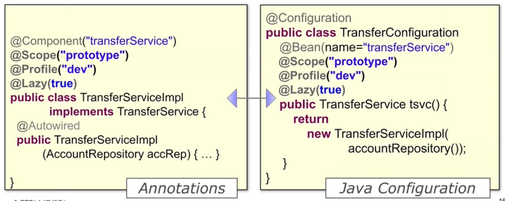
- For the classes we do not own (infrastructure) we only can use Java Config.

#### Best practices [M4E2]
* Spring by default prioritizes no-arg constructor.
- Component Scanning
  - Really bad: `@ComponentScan("com", "org")`
  - Still bad: `@ComponentScan("com")`
  - OK: `@ComponnetScan("com.bank.app")`
  - Optimized: `@ComponentScan({"com.bank.app.repository", "com.bank.app.service", "com.bank.app.controller"})`

### Life cycle annotations  and `@PreDestroy` [M4E3]
- `@PostConstruct`: is called at startup after all dependencies are initialized.
- `@PreDestroy`: called at shutdown prior to destroying the bean instance.
  - Only is called when the application shuts down normally, not if the process dies of is killed.
  - Useful for releasing resources & cleaning up.
  - Not called for prototype beans.
  - Runs on `ConfigurableApplicationContext::close()"`
  - Spring app on startup will automatically register a JVM shutdown hook (`System.exit()`/`Runtime.exit()`).
- These methods can have **any visibility** but must take **no parameters** and only **return void**.
- These are not Spring annotations!
  - Defined by JSR-250, part of JDK6.
  - Located at `javax.annotation` package.
  - Supported by Spring, and Java EE (Jakarta E).
- Alternatively: `@Bean(initMethod="populateCache", destroyMethod="flushCache)`

### Stereotype annotations [M4E4]
- Annotations that are themselves annotated with `@Component`.
- These annotations are also picked up when ComponentScanning.
- `@Component` is a meta-annotation. it can be used to annotate other annotations.

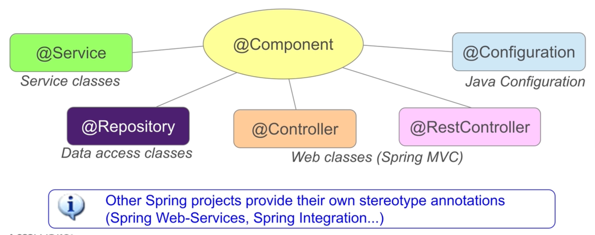

## Inside the Spring container [M5]
* The content of this chapter is a simplified view of spring's inner workings.
- Spring bean lifecycle:
  1. Initialization
     - A. Load & Process Bean Definitions
       - The `@Configuration` classes, xml files, and `@Component` classes are scanned.
       - Bean Definitions added to **BeanFactory** each indexed under its id and type.
       - Special **BeanFactoryPostProcessor** beans invoked, which can modify the definition of any bean.
     - B. Perform Bean Creation
  2. Usage
     - Beans are available for use in the application.
  3. Destruction (Application context closed)
     - Beans are released for Garbage Collection.

---
### 1. Initialization phase

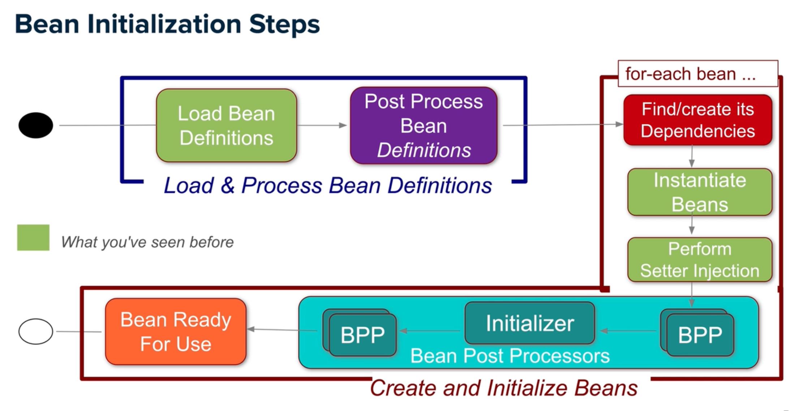

- `ApplicationContext` is a `BeanFactory`.

- `BeanFactoryPostProcessor`
  - Is a functional interface.
    ```java
    public interface BeanFactoryPostProcessor {
        void postProcessBeanFactory(ConfigurableListableBeanFactory beanFactory);
    }
    ```
  - Is a Spring extension point
  - Allows you to modify bean definitions before any beans are actually instantiated.
  - `PropertySourcesPlaceholderConfigurer` (Spring 4.3+) is an example of it that resolves `@Value("${}")` placeholder values.
  - It needs to run before any beans are created so use of **static** `@Bean` method is recommended.
  - It's an internal bean invoked by spring (not your code).

- The Initializer extension point
  - Special case of a bean post-processing
  - Causes initialization methods to be called (`@PostConstruct`, `init-method`, etc.)
  - Internally Spring uses several initializer BPPs. (`CommonAnnotationBeanPostProcessor` enables JSR-250 annotations like `@PostConstruct`, `@Resource`, etc.)

- `BeanPostProcessor` Extension point
  - Can modify bean **instances** in any way.
  - Will run against every bean.
  - Can modify a bean before and/or after Initialization.
  ```java
  public interface BeanPostProcessor {
      Object postProcessBeforeInitialization(Object bean, String beanName);
      Object postProcessAfterInitialization(Object bean, String beanName);
      // Object in method args -> Original bean
      // Object in method return -> Post-processed bean
      // If the bean is not retuned, it will be lost!
  }
  ```
  - The beanPostProcessor classes can be a normal bean in spring, annotated with `@Component` or `@Bean` in config class.
  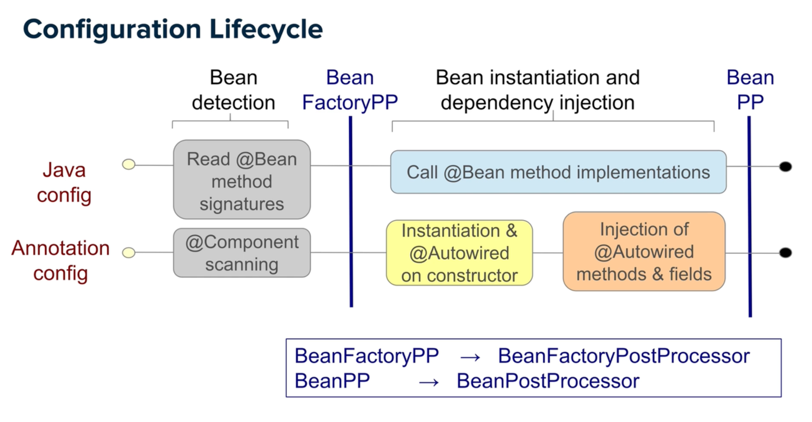


### 2. Usage phase [M5E3]
- When retrieving a bean, two cases may occur:
  1. The retrieved bean is just a bean: Nothing new!
  2. The retrieved bean is a **Proxy** to the original bean!
- The proxy is created during initialization phase by a `BeanPostProcessor`.
- The BPP wraps your bean in a "proxy" adding behavior to it transparently.
- Example: Transactions
  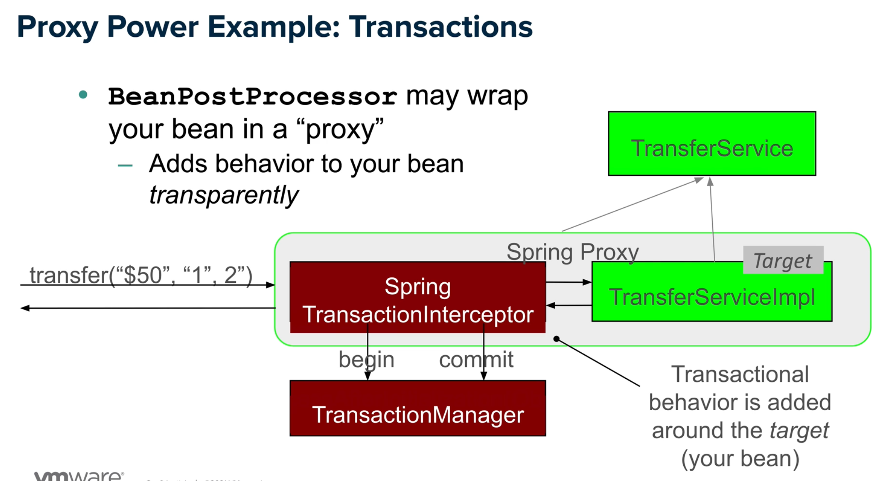

#### Kinds of proxies
- **JDK Proxy**
  - Also called dynamic proxies
  - API is built into the JDK
  - Requirements: Java Interface(s)
  - All interfaces proxied
- **CGLib Proxy**
  - Not built into JDK
  - Included in Spring jars
  - Used when interface is not available
  - Cannot be applied to final classes or methods
  - Spring Boot will always go with CGLib Proxies. (JDK Proxy can be used in vanilla Spring)
  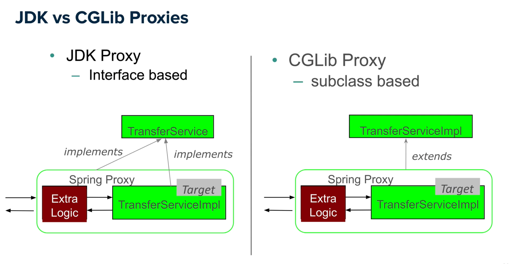

### Destruction phase
- All beans are cleaned up
  - Any registered `@PreDestroy` methods are invoked.
  - Beans released for the Garbage Collector to destroy.
- Happens when we close the context. (`ConfigurableApplicationContext::close()`)
- Also happens when any bean goes out of scope (except Prototype scoped beans).
- Only happens when app is shutdown gracefully, not if killed or crashed.

### More on Bean Creation [M5E4]
- Find/create the bean dependencies is a **recursive** process.
- You can force dependency order by `@DependsOn("beanName")` both with annotation-based config method and java config.
```java
@Component
@DependsOn("accountService")
class TransferService {
  // ...
}
```
- In this example `TransferService` will be created right after `AccountService`.

#### Determining Bean Name & Type

| Definition                     | Name                                                               | Type                    |
|--------------------------------|--------------------------------------------------------------------|-------------------------|
| **1. Java config**             | From `@Bean` name/value attribute<br>Or from method name           | From method return type |
| **2. Annotation-based Config** | From annotation value attribute<br>Or derived from class name      | From annotated class    |

- **1** typically returns an *interface*
- **2** provides *actual* implementation class

#### Why won't this work?

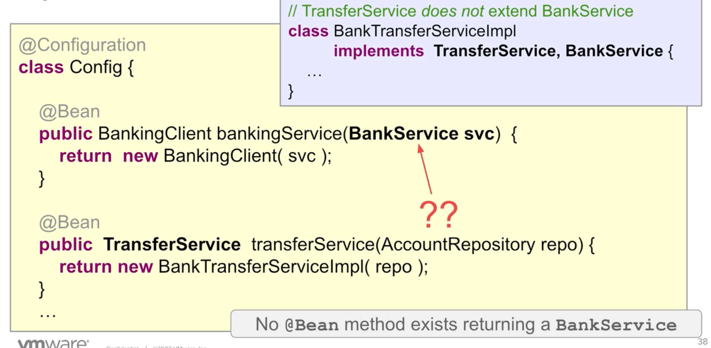

- **Solution 1:** Use `BankTransferServiceImpl` as return type instead of `TransferService` in the second `@Bean`; giving more info to the container.
- **Solution 2:** Create a composite interface and use it as return type of second `@Bean` like so:
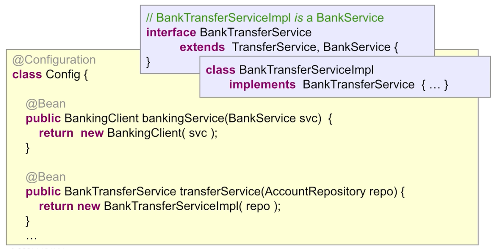
- Can determine `BankTransferService` extends both `TransferService` and `BankService`.

#### Best practices of defining Spring Beans
  - Aim to be "sufficiently expressive"
    - Return interfaces except where multiple interfaces exists and they are needed for dependency injection.
    - Coding to interface is good practice.
  - **Warning:** Even if you return implementation types:
    - Still use interfaces when injecting dependencies.
    - Injecting implementation types is brittle: may fail if the bean is proxied or a different implementation returned.

## Introducing Aspect Oriented Programming (AOP) [🔗](https://docs.spring.io/spring-framework/reference/core/aop.html) [M6]
- Enables modularization of cross-cutting concerns like:
  - Logging and tracing
  - Transaction Management
  - Security
  - Caching
  - Error Handling
  - Performance Monitoring
  - Custom Business Rules
- How to find cross-cutting concerns? The `every` keyword in:
  - Perform a role-based security check before _every_ application method.
- What will having with no AOP?
  - Code Tangling: concerns coupling
  - Code Scattering: same logic everywhere
  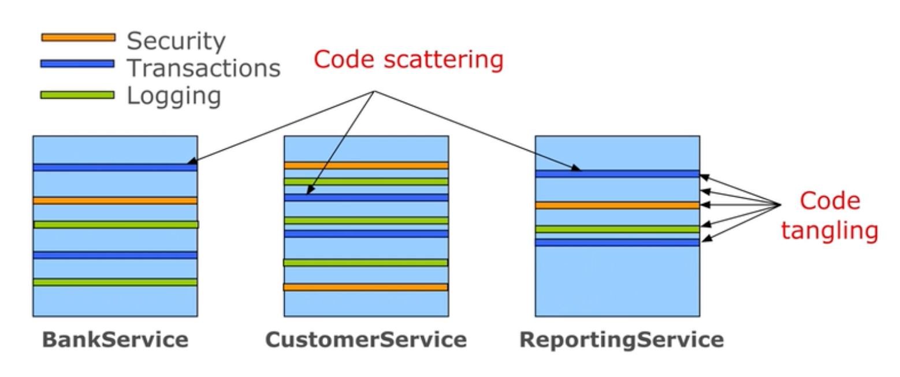

### Leading AOP Technologies
- AspectJ
  - Original AOP technology (since 1995)
  - A full-blown AOP language, Using bytecode modification for aspect weaving.
- Spring AOP
  - Java-based AOP framework with AspectJ integration
  - Using dynamic proxies for aspect weaving.

### Core AOP Concepts [M6E2]
- **JoinPoint:** A point in the execution of a program such as method call or exception thrown.
  - ℹ️ Spring AOP only allows method calls as join points. 
- **Pointcut:** An expression that selects one or more JoinPoints.
- **Advice:** Code to be executed at each selected JoinPoint.
- **Aspect:** A module that encapsulates pointcuts and advice.
- **Weaving:** Technique by which aspects are combined with the main code.
- **TargetClass**
- **Proxy**

### Implementing the Aspect
- The aspect should be a bean.
```java
@Aspect // <---
@Component
public class PropertyChangeTracker {
    private Logger logger = Logger.getLogger(getClass());
    
    @Before("execution(void set*(*))") // <--- The advice with pointcut defined
    public void trackChange(JoinPoint point) { // <--- JoinPoint parameter provides context about the intercepted point
        String methodName = point.getSignature().getName();
        Object newValue = point.getArgs()[0];
        logger.info(methodName + " about to change to "
                + newValue + " on " + point.getTarget());
    }
}
```

- Next we should enable the use if `@Aspect`.

```java
    @Configuration
    @EnableAspectJAutoProxy // <--- using Spring AOP for weaver (Proxy)
    @ComponentScan(basePackage="com.example.aspects") // <---
    public class AspectConfig {
      //
    }
```

### How Aspects are applied
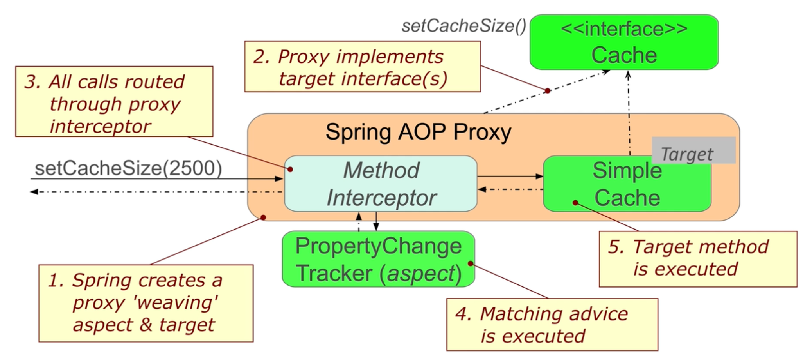

### Which method is going to get proxied?
- When using JDK proxy, only methods existing in the interface will be proxied.

### Defining Pointcuts [M6E3]
- [Pointcut API in Spring](https://docs.spring.io/spring-framework/reference/core/aop-api/pointcuts.html)
- [AspectJ Documentation](https://eclipse.dev/aspectj/doc/latest/index.html)
- Spring AOP uses AspectJ's pointcut expression language.
- Spring AOP is a subset of AspectJ.

#### Common Pointcut Designator
- `execution(<method pattern>)`: The method must match the pattern.
- Can chain together to create composite pointcuts.
  - `&&` and, `||` or, `!` not.
  - `execution(<pattern1>) || execution(<pattern2>)`
- Method Pattern:
  - `[Modifiers] ReturnType [ClassType] MethodName (Arguments) [throws ExceptionType]`

#### Example pointcut expression
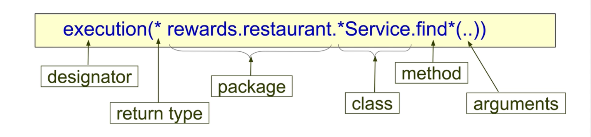
- Wildcards:
  - `*` matches once (return type, package, class, method name, argument)
  - `..` matches zero or more (argument or package)

- `execution(void send*(rewards.Dining))`
  - Any method starting with `send` that takes a single `Dining` parameter and has a void return type.
  - Note the use of fully qualified class name. any types except primitives and String require it.

- Implementation vs. Interface
  - Restrict by class: `execution(void example.MessageServiceImpl.*(..))`
    - Any void method in the `MessageServiceImpl` class, including any subclasses.
    - But will be ignored if a different implementation is used.
  - Restrict by Interface: `execution(void example.MessageService.send(*))`
    - Any void send method taking one argument, in any object implementing MessageService.
    - More flexible choice works if the implementation changes.
  - Using Annotations: `execution(@javax.annotation.security.RolesAllowed void send*(..))`
    - Any void method whose name starts with `send` that is annotated with the `@RolesAllowed` annotation.
        ```java
        public interface Mailer {
            @rolesAllowed("USER")
            public void sendMessage(String text);
        }
        ```

### Implementing Advice [M5E4]
#### Before
- If the advice throws an exception, the target will not be called. This is a valid use of Before Advice.
  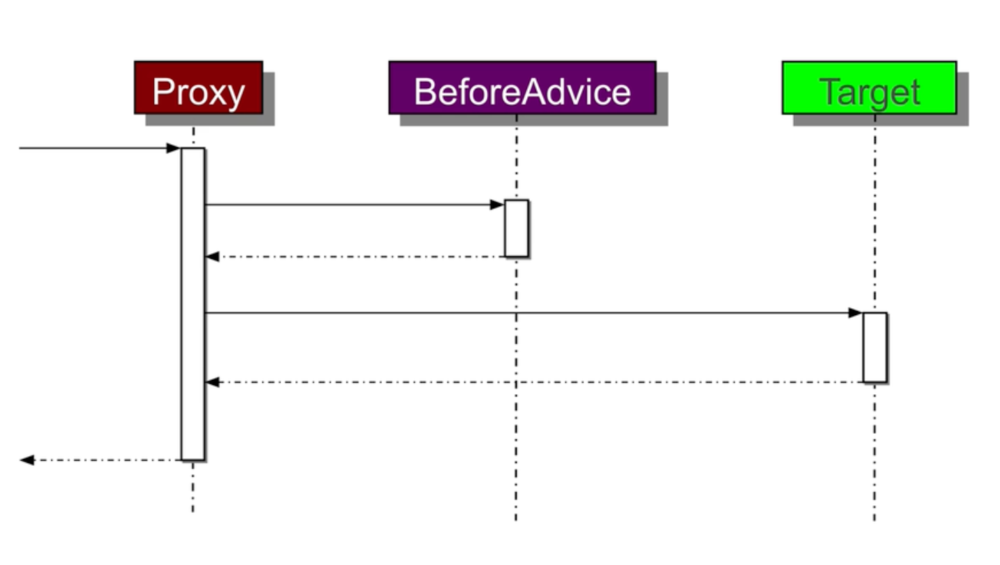

#### After Returning
  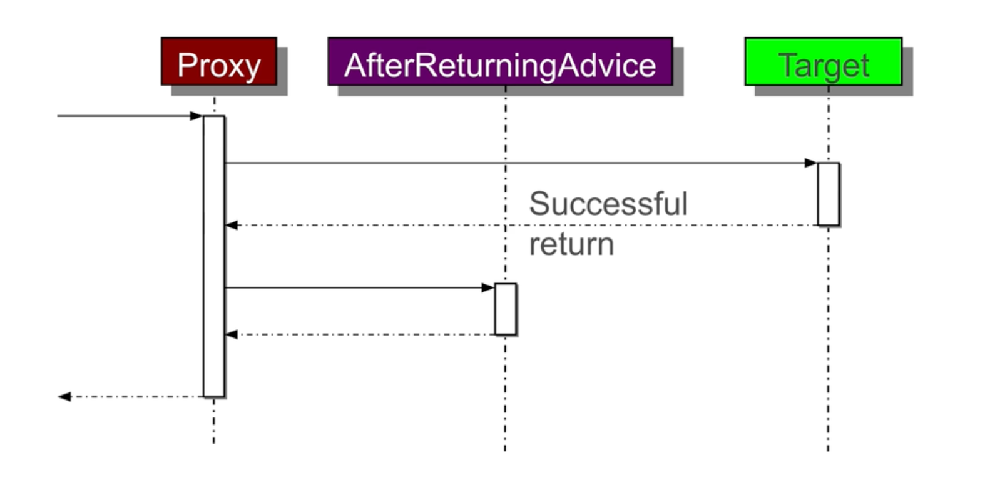
  ```java
  @AfterReturning(value = "execution(* service..*(..))", returning = "reward")
  public void audit(JoinPoint jp, Reward reward) {
      auditService.logEvent(jp.getSignature() +
          " returns the following reward object: " + reward.toString());
  }
  // Audit all operations in the service package that return a `Reward` object.
  ```
- Uses the `reward` parameter Type and uses it as pointcut return type.

#### AfterThrowing
- Only invokes if the right exception type is thrown.
- It will not stop the exception from propagating, but it can throw a different type of exception. (translation)
- ℹ️ If you with to stop the exception from propagating any further, you can use an `@Around` advice.
  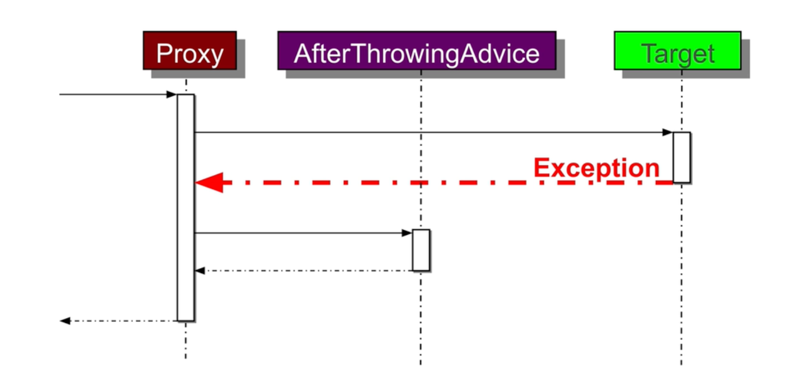
  ```java
  @AfterThrowing(value = "execution(* *..Repository.*(..))", throwing = "e")
  public void report(JoinPoint jp, DataAccessException e) {
      mailService.emailFailure("Exception in repository", jp, e);
  }
  // Sends an email every time a Repository class
  // throws an exception of type DataAccessException
  // or any child of it.
  ```
  
#### After
- Called regardless of whether an exception has been thrown by the target or not.
  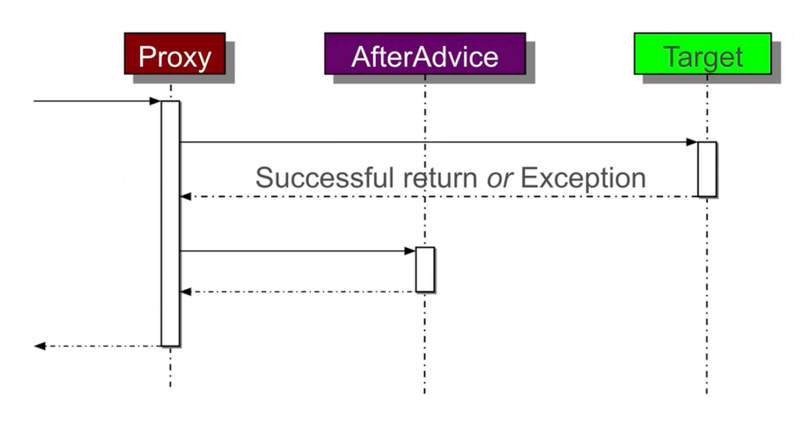
  ```java
  @After("execution(void update(..))")
  public void trackUpdate() {
      logger.info("An update has been attempted...");
  }
  // We dont know how the method terminated
  ```
    
#### Around
- The most powerful and the most dangerous (We are responsible to delegate to the target).
- `ProceedingJoinPoint` inherits from `JoinPoint` and adds the `proceed()` method.
  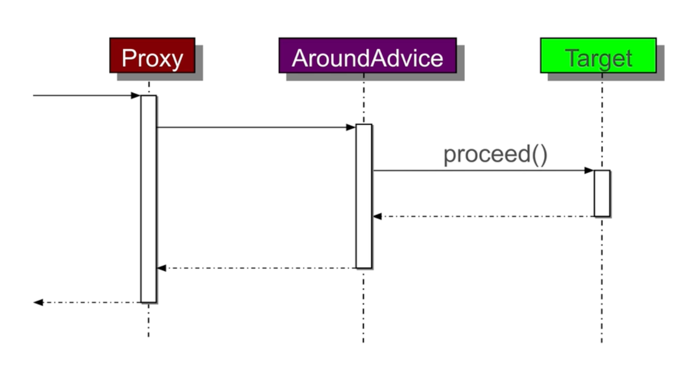
  ```java
  @Around("execution(@example.Cacheable * rewards.service..*(..))")
  public Object cache(ProceedingJoinPoint point) throws Throwable {
      Object value = cacheStore.get(CacheUtils.toKey(point));
  
      if (value != null) return value; // <--- Value exists? if so just return it.
  
      value = point.proceed(); // <--- Proceed only if not already cached
      cacheStore.put(CacheUtils.toKey(point), value);
      return value;
  }
  // Cache values returned by chacheable services.
  ```


### Limitations of Spring AOP
- Can only advise _non-private_ methods.
- Can only apply aspects to _Spring Beans_.
- Limitations of weaving with proxies
  - When using proxies, suppose method a() calls method b() on the _same_ class/interface
    - advice will _never_ be executed for method b().
  - So inner calls will not be proxied.


## Testing Spring Application [M7]
### JUnit 5
- JUnit 5 support is a major feature of Spring 5.3
- It's the default JUnit version from SpringBoot 2.6
- Requires Java 8+ at runtime
- JUnit 4 was a monolith, everything in a single jar.
- JUnit 5 is written from scratch and divided to 3 components (Separation of concerns).
- Components
  - **JUnit Platform**: A foundation for launching testing frameworks in the JVM.
  - **JUnit Jupiter**: The API we use for writing tests and extensions in JUnit 5. (Jupiter is the fifth planet of the solar system)
  - **JUnit Vintage**: A _TestEngine_ for running JUnit 3 & 4 tests on the platform.
- JUnit 5 features new annotations, some of them replacing old JUnit 4 annotations.

| JUnit 4 Annotation | JUnit 5 Annotation                        |
|--------------------|-------------------------------------------|
| `@Before`          | `@BeforeEach`                             |
| `@After`           | `@AfterEach`                              |
| `@BeforeClass`     | `@BeforeAll`                              |
| `@AfterClass`      | `@AfterAll`                               |
| `@Ignore`          | `@Disabled`                               |
| `@RunWith`         | `@ExtendWith` (Multi-extension supported) |
- New annotations introduced
  - `@DisplayName`
  - `@Nested`
  - `@ParameterizedTest`
  - many more...
- JUnit 5 ignores all JUnit 4 annotations.

### Integration Testing with Spring [M7E2]
- Unit Test > Integration Test > Performance Test > End-to-end Test.
- Unit Test
  - Test a class in isolation, Keeping dependencies minimal.
  - Uses simplified alternatives for dependencies (Stubs and/or Mocks)
  - Spring is not needed for unit test.
- Integration Test
  - Since we are testing integration of multiple units together, We need Spring.
  - Each component (unit) should work individually first (Unit test showed this).
  - Tests application classes in context of their surrounding infrastructure.
    - Out-of-container testing, no need to run up full App Server.
    - Infrastructure may be scaled down (Using ActiveMQ instead of commercial messaging server)
    - Test Containers (Use of lightweight, throwaway instances of common DBs)

#### Spring support for [testing](https://docs.spring.io/spring-framework/reference/testing.html)
- It has `TestContext` framework that defins an `ApplicationContext` for tests.
- `@ContextConfiguration` Defines the spring configuration to use.
- It's packaged as a separate module `spring-test.jar`.
- `SpringExtension` class is a Spring aware JUnit 5 extension.
  ```java
  @ExtendWith(SpringExtension.class) // Run with Spring support
  @ContextConfiguration(classes={SystemTestConfig.class}) // Point to system test configuration file(s)
  public class TransferServiceTests {
      @Autowired
      private TransferService transferService; // Inject bean to test
      // No need for @BeforeEach method for creating TransferService 
      
      @Test
      public void shouldTransferMoneySuccessfully() {
          TransferConfirmation conf = transferService.transfer(...);
          // Test the system as normal
      }
  }
  ```
- `@SpringJUnitConfig(SystemTestConfig.class)` is "composed" annotation that combines:
  - `@ExtendWith(SpringExtension.class)` from JUnit 5
  - `@ContextConfiguration(classes={SystemTestConfig.class})` from Spring

- Use of `@Autowired` in test method parameters are allowed (Only in tests).
  ```java
      public void shouldTransferMoneySuccessfully(@Autowired TransferService transferService) {
          TransferConfirmation conf = transferService.transfer(...);
          // Test the system as normal
      }
  ```

- Test context configuration can be defined as an inner class!
  - We can use `@Import` and then overwrite the IoC bindings in the config class.  
  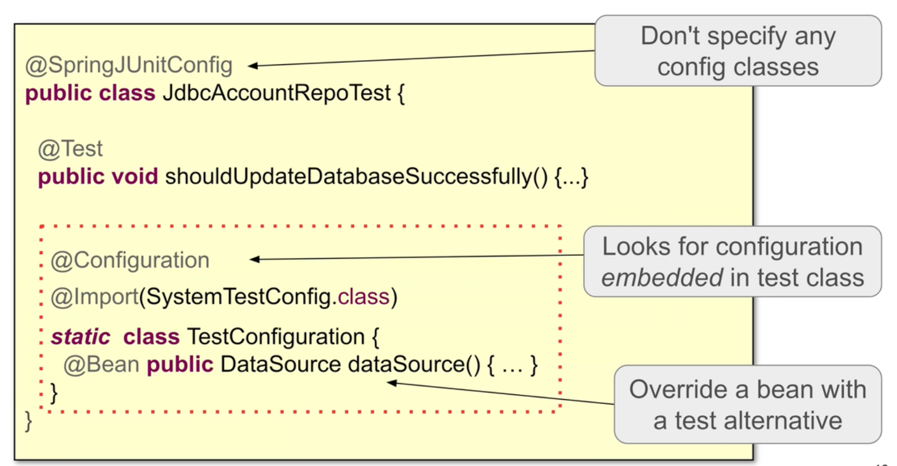
- Using `@SpringJUnitConfig` Spring will create the _ApplicationContext_ once and **reuse** that for every test method.
- Using `@DirtiesContext` forces context to be closed at the end of test method.
  - Allows testing of `@PreDestroy` behavior.
  - Next test gets a new ApplicationContext.
  ```java
  @Test
  @DiritesContext
  public void testTransferLimitExceeded() {
    transferService.setMaxTransfers(0);
    // Do a transfer, expect a failure.
  }
  ```
- Using `@TestPropertySource` on the test class, definition of properties just for testing is possible.
  - Has higher precedence. (overwrites other properties)
  ```java
  @SpringJUnitConfig(SystemTestConfig.class)
  @TestPropertySource(
      properties = {"username=foo", "password=bar"},
      locations = "classpath:/transfer-test.properties"
  )
  public class TransferServiceTest {
      // ...
  }
  ```

#### Testing with profiles [M7E3]
- Enabling profiles with passing system properties won't work for tests.
- `@ActiveProfiles({"jdbc", "dev"})` for test class defines one or more profiles.
- Beans associated with that profiles or no profiles will be instantiated.

#### Testing with databases
- `@Sql("test-files/test-data.sql")` can be used at class level to run scripts before **each** test method.
- It also can be defined at method level, **overwriting** class level definition for that method.
- Multiple definitions are allowed.
  ```java
  @Sql(
    scripts = "test-files/cleanup.sql",
    executionPhase = Sql.ExecutionPhase.AFTER_TEST_METHOD,
    config = @SqlConfig(
        errorMode = ErrorMode.FAIL_ON_ERROR, // CONTINUE_ON_ERROR, IGNORE_FAILED_DROPS, DEFAULT*
        commentPrefix = "//",
        separator = "@@"
    )
  )
  ```
- `DEFAULT` errorMode: whatever `@Sql` defines at class level, otherwise `FAIL_ON_ERROR`.

## JDBC Simplification with Jdbc Template [M8]
- It uses template design pattern (Eliminates boilerplate code).
- It's written by Rod Johnson himself, co-founder of Spring.
- Alleviates common causes of bugs
- Handles `SQLException`s properly.
- Provides full access to the standard JDBC constructs.
```java
int count = jdbcTemplate.queryForObject(
    "SELECT COUNT(*) FROM CUSTOMERS",
    Integer.class
);
```
- This one line will do (All handled by Spring):
  - Acquisition of the connection
  - Participation in the transaction
  - Execution of the statement
  - Processing of the result set
  - Handling exceptions
  - Release of the connection

  ```java
  List<Customer> results = jdbcTemplate.query(someSql,
      new RowMapper<Customer>() {
          public Customer mapRow(ResultSet rs, int row) throws SQLException {
            // map the current row to a Customer object.
          }
      }
  );
  ```
- The `new RowMapper<Customer>()` is an anonymous class definition using `RowMapper` interface.

### Creating a JdbcTemplate
- Requires a DataSource.
  ```java
  JdbcTemplate template = new JdbcTemplate(dataSource);
  ```
- Create a template once and re-use it, Thread-safe after construction.

### Querying with JdbcTemplate [M8E2]
- JdbcTemplate can query for
  - Simple types (int, long, String, Date, ...)
    ```java
    // No bind variables
    jdbcTemplate.queryForObject("select min(dob) from PERSON", Date.class);
    // Older alternatives, queryForInt(), queryForLong(), deprecated and removed since Spring 4.2
    
    // With bind variables
    jdbcTemplate.queryForObject(
        "select count(*) from PERSON where age > ? and nationality = ?",
        Integer.class,
        age,
        nationality.toString()
    );
    ```
  - Generic Maps
  - Domain Objects

- It has `update()` method for **inserting, updating, and deleting** rows. (Any non-SELECT SQL)
```java
// Insert
jdbcTemplate.update(
    "insert into PERSON (first_name, last_name, age) values (?, ?, ?)",
    person.getFirstName(),
    person.getLastName(),
    person.getAge()
);

// Update
jdbcTemplate.update(
    "update PERSON set age = ? where id = ?",
    person.getAge(),
    person.getId()
);
```
- There is also a method called `execute()` for DDL operations.

### Working with ResultSets [M8E3]
#### Generic Maps
- `JdbcTemplate` can return each row of a `ResultSet` as a `Map<String, Object>`.
  - The key will be column name, value will be column value.
  - `queryForMap()` for a single row.
  - `queryForList()` for multiple rows.
- Useful for ad hoc reporting, testing.
* Ad hoc: created or done for a particular purpose as necessary. (windows-on-data queries).

#### Domain Objects
- JdbcTemplate supports this using a callback approach.
- You may prefer to use ORM for this, need to decide between JdbcTemplate queries and JPA mappings.
- Callback interfaces
  1. `RowMapper<T>` is a functional interface for processing each row of Result set.
    - Having a `T mapRow(ResultSet rs, int rowNum) throws SQLException` method.
    - 1:1 mapping
  2. `ResultSetExtractor<T>` is a functional interface for processing entire ResultSet at once.
     - Having a `T extractData(ResultSet rs) throws SQLException, DataAccessException` method.
     - N:1 mapping
  ```java
  jdbcTemplate.query(
      "select .. from order o, item i .. confirmation_id = ?",
      (ResultSetExtractor<Order>) (rs) -> { // Casting is needed as multiple implementations with `rs` exists.
          Order order = null;
          while (rs.next()) {
              if (order == null)
                  order = new Order(rs.getLong("id"), rs.getString("name"), ..);
              order.addItem(mapItem(rs));
          }
          return order;
      },
      number
  );
  ```
  3. `RowCallbackHandler` like RowMapper but no return is needed!
     - Useful when we want to process or write the data to a destination.
     - 1:1 Mapping

### Exception Handling [M8E4]
- Checked Exception (Developer forced to handle/declare it)
  - BAD: intermediate methods must declare exception(s) from all methods below (Tight-coupling)
- Unchecked Exception
  - Can throw up the call hierarchy to the best place to handle it.
  - GOOD: Methods in between don't know about it.
  - **Spring always throws RuntimeExceptions (Unchecked).**
- `SQLException` checked exception that vanilla JDBC throws.
  - Too general - one exception for every database error.
  - Calling class knows you're using JDBC.
- Spring provides `DataAccessException` hierarchy
  - Hides whether you are using JPA, Hibernate, JDBC ...
  - Actually a hierarchy of sub-exceptions.

  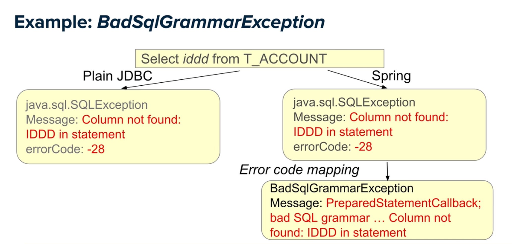

  - [SQLException error code mapping to Spring DataAccessExceptions](https://github.com/spring-projects/spring-framework/blob/main/spring-jdbc/src/main/resources/org/springframework/jdbc/support/sql-error-codes.xml)

  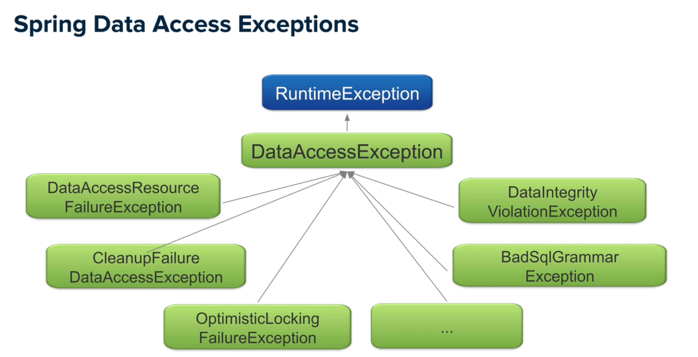

## Transaction Management with Spring [M9]
- In java we have different APIs for managing transactions (JDBC, JPA, JMS)
- ACID principals enable concurrent access to shared resource.
  - Atomic: All or nothing
  - Consistent: Data integrity never violated
  - Isolated: transactions are isolated from each other
  - Durable: Committed changes are permanent
- No transactions -> Connection per data access operation (less efficient)

  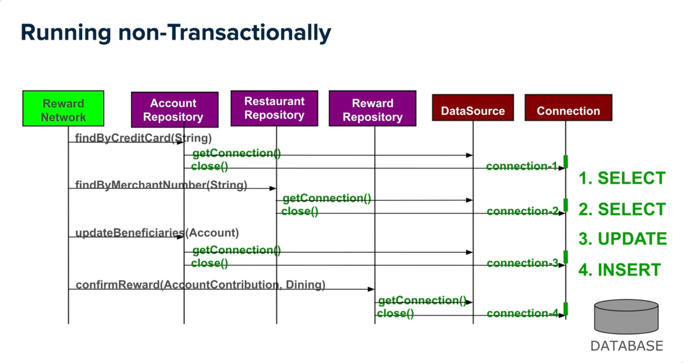
  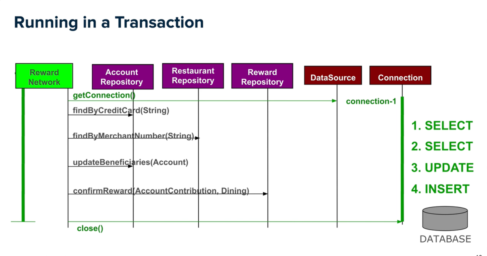

### Spring Transaction Management [M9E2]
- Spring separates transaction _demarcation_ from transaction _implementation_.
- Demarcation expressed declaratively via AOP (`@Transactional` annotation).
  - Programmatic approach is also available.
- The main component in transaction management: `PlatformTransactionManager` Interface.
  - Abstraction hides implementation details
  - Multiple implementations available.
- Spring uses the same API for global vs. local, switching requires only changing the transaction manager.
  - Local transaction: Only one resource is involved (e.g. One Database).
  - Global transaction: Also called _Distributed Transaction_ coordinates multiple transactional resources.
    - Uses JTA (Jakarta Transaction API) under the hood.

### How to enable springs transaction support?
1. Declare a `PlatformTransactionManager` bean.
2. Declare a Transactional method.
    - Using annotations or programmatic (Can mix and match)
3. Add `@EnableTransacitonManagement` to configuration class.
    - Defines a bean post-processor to proxy `@Transactional` beans.
    - It uses an `Around` advice.
        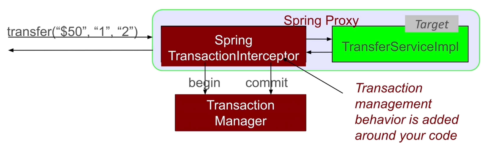

### PlatformTransactionManager Implementations
- `DataSourceTransactionManager`
- `JmsTransactionManager`
- `JpaTransactionManager`
- `JtaTransactionManager`
- `WebLogicJtaTransactionManager`
- `WebSphereUowTransactionManager`
 
- Example (Local):
  ```java
  @Bean
  public PlatformTransactionManager transactionManager(DataSource dataSource) {
      return new DataSourceTransactionManager(dataSource);
  }
  // A DataSource bean must be defined elsewhere
  ```
  - Bean id `transactionManager` is recommended name.

- Example (Global):
  ```java
  @Bean
  public PlatformTransactionManager transactionManager() {
      return new JtaTransactionManager();
  }
  
  @Bean
  public DataSource dataSource(@Value("${db.jndi}") String jndiName) {
      JndiDataSourceLookup lookup = new JndiDataSourceLookup();
      return lookup.getDataSource(jndiName);
  }
  ```
  - Or use container-specific subclasses like `WebLogicJtaTransactionManager`.
  - Spring doesn't have any JTA implementations. A full-blown application server is needed or an implementation.

### @Transactional: What happens exactly?
- Proxy implements the following behaviour
  - Transaction started before entering the method
  - Commit at the end of the method
  - Rollback if method throws a `RuntumeException`
    - Default behaviour (Can be overridden)
    - Checked exceptions **do not cause rollback**!
- All controlled by configuration

### Transaction bound to current thread
- Holds the underlying JDBC connection.
- Hibernate sessions, JTA work similarly.
- You can access the connection manually: `DataSourceUtils.getConnection(dataSource)`

### More
- `@Transactional` can be declared at class level making all the methods transactional.
- Since Spring Framework 5.0 it can be declared **at interface level**.
- Method can also be annotated, **overriding class level config**.
- Java also has a `javax.transaction.Transactional`!
  - Also supported by Spring, but has fewer options.
  - Better to use the Spring one.
